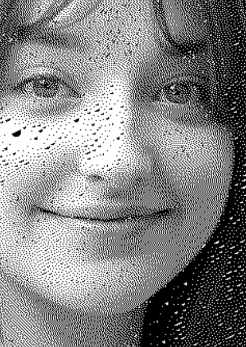
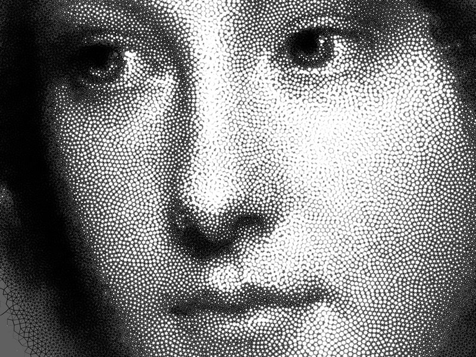

# Dithering

`Dithering` 에도 종류가 있는데, `Floyd-Steinberg`의 `Dithering`을 구현해보았다.  
Openframeworks에서 픽셀을 건드리는게, 생각보다 문서가 잘 없어서 힘들었고, 고작 이 픽셀 접근 때문에, 구현하기 까지 몇 달이 걸렸던 것 같다. 알고보니 인덱스 문제였지만... 

아래는 구현 이미지이다. 모델은 angelona Danilova.

이론적인 내용은, 한 픽셀의 비트 정보를 줄여나가면서 .. 인접한 픽셀에 대해 오차 값을 전파하는 알고리즘이다. 전파하는 값과 방향이 평등하지 않으므로, 가로 축으로 먼저 순회를 돌지 높이 축으로 먼저 순회를 돌지에 따라 결과물이 다르다. 나는 가로 부터 먼저 순회를 돌아 전파하였다.   
`dithering` 작품만으로도 충분히 이쁜 결과물이 나오겠지만, `stippling`이란 것도 볼 필요가 있겠다. 아래는 `stiplling`을 활용한 작품이다. [stippling이란?](http://roberthodgin.com/portfolio/stippling/)  

