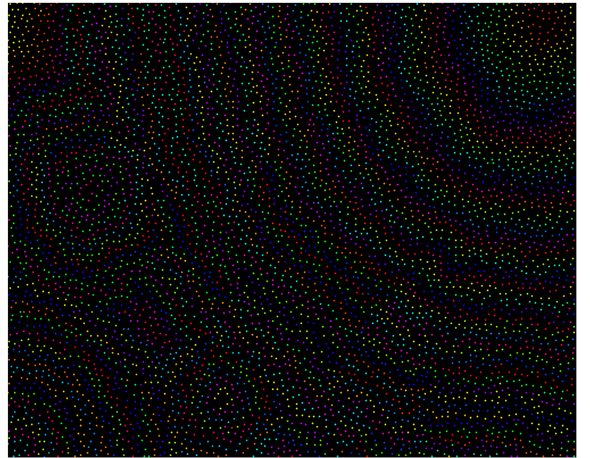
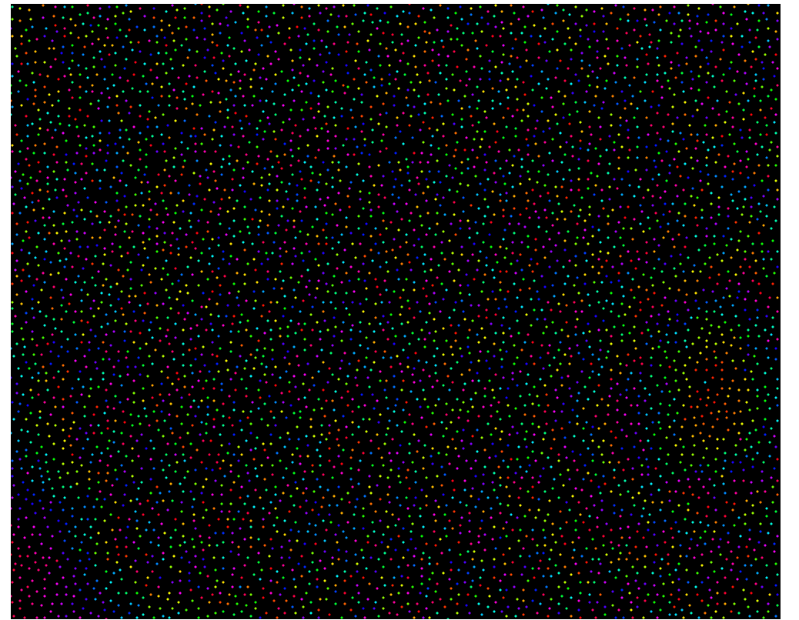

# Poisson disc sampling 

## About Algorithm

Poisson disc sampling algorithm provides good distribution of points' set.  
Drawing dots on paper with naive randomized value makes some cohesion of dots.  
But Poisson disc sampling algorithm distribute dots on paper with minimum distance `r`.  

you may think that if any point on paper has minimum distance at least `r` with others, then It needs to be calculated with O(n2) complexity.  

Following documents suggests efficient algorithm that can be done with O(n).  

[docs](https://www.cs.ubc.ca/~rbridson/docs/bridson-siggraph07-poissondisk.pdf)

To short algorithm,   

1. Partition your paper in `2-dimensional`.  
2. Determine minimum distance. Algorithm suggests that first step and second step has relations each other. so you just use `variable r` for minimum distance and `r/Constant` for Partitioning.  
3. Pick a random point and draw it and push in a queue or any datastructure (array with a random accessor gives us beautiful work).      
4. Pop a point from a queue and calculate a random point which has a distance `(r ~ ...)` from popped point.   
5. If desired partition for a random point has already a point, then discard a random point and go-back to `step 4`. you can repeat this with any amount. The document says repeating `30` will be fine.     
6. If queue is empty, then draw all points.  

End of Algorithm. Its time complexity is O(n), O (Partition) or O(Point).  

## Result  
### Pure Algorithm visualization  

### with HSB color Mode  

### Just one call draw method  

### with mouse click event   

### with mouse click event2, Improved time complexity.   

### with mouse click event3, sequential access. (Improved)  

### with mouse click event4, randomized access. (Improved) 

