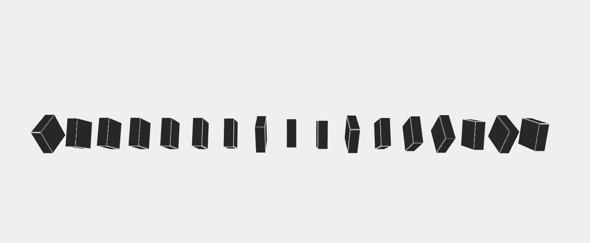

# 190623_RotatingBox
inspired by `junkiyoshi blog`



## impressing part 
force 개념을 추가하여, 박스가 퍼지고 줄어들게 끔 했다. sin + perlinNoise 를 이용했는데,  미관적으로 편안한 느낌을 준다. 적당한 난수로 돌리는 것을 판별하는 것 도 좋았다.

````C++
void ofApp::draw() {
	this->cam.begin();

	auto force = sin(ofNoise(ofGetFrameNum() * 0.007)*PI);
	if (force <= -0.8) force = -0.8;

	for (int i = 0; i < locations.size(); i++)
	{

		int sz = locations.size();

		ofPushMatrix();
		auto x = locations[i].y, y = locations[i].x;

		ofTranslate(x*(force+1), y);

		auto noise = ofNoise(i * 0.1, ofGetFrameNum() * 0.001, ofRandom(10)*0.001);
		if (noise >= 0.3)
		{
			ofRotateX(ofMap(noise, 0.3, 1, 0, 360 * 3));
		}
		auto m = width * 3;

		ofFill();
		ofSetColor(39);
		ofDrawBox(glm::vec3(0, 0, 0), width,m, m);

		ofNoFill();
		ofSetColor(239);
		ofDrawBox(glm::vec3(0, 0, 0), width,m, m);

		ofPopMatrix();
	}

	this->cam.end();
}
````