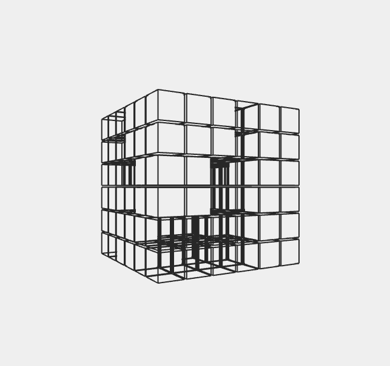

# 191003_rotatingBoxes
from `junkiyoshi blog`



보기만큼, 쉬운 작업이다. 도형을 fill하는 색과 border색이 같음을 이해하여 구현해야한다.


```c++
void ofApp::draw() {

	this->cam.begin();
	ofRotateY(ofGetFrameNum() * -0.5);

	int boxUnitSize = 40;
	for (int x = -100; x <= 100; x += boxUnitSize)
	{
		for (int y =-100; y<= 100; y+= boxUnitSize)
		{ 
			for (int z = -100; z <= 100; z += boxUnitSize)
			{
				auto noise = ofNoise(ofGetFrameNum() * 0.006, x * 0.005, y * 0.005, z * 0.005);
				ofPushMatrix();
				// non box
				if (noise < 0.2);
				// transparent
				else if (noise < 0.5)
				{
					ofNoFill();
					ofSetColor(39);
					ofDrawBox(glm::vec3(x, y, z), boxUnitSize-3);
				}
				// no transparent, but have border
				else if ( noise < 0.9 )
				{
					ofFill();
					ofSetColor(239);
					ofDrawBox(glm::vec3(x, y, z), boxUnitSize-5);

					ofNoFill();
					ofSetColor(39);
					ofDrawBox(glm::vec3(x, y, z), boxUnitSize-3);
				}
				// no transparent, but have border. another color.
				else
				{
					ofFill();
					ofSetColor(39);
					ofDrawBox(glm::vec3(x, y, z), boxUnitSize-3);

					ofSetColor(239);
					ofDrawBox(glm::vec3(x, y, z), boxUnitSize-5);

				}
				ofPopMatrix();
			}
		}
	}

	this->cam.end();
}
```

