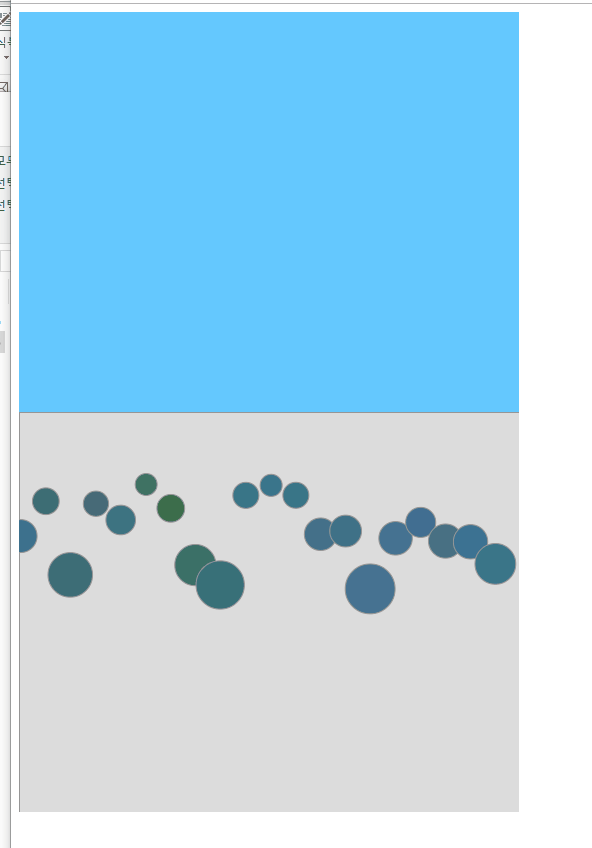

## Forces

#### KeyWord : "힘, 가속도, 속력", 중력, 마찰력, 유체 마찰력, 인력  

이번 챕터는 흥미로웠고, 재밌었다. 단순 고등학교 물리에서부터 대학 1학년 물리를 구현하는 것이였다.  
구현하는데에 있어, 동작하는 물체들을 Mover 클래스의 객체로 다루었으며, Mover 클래스는 위치 (x,y)정보, 받은 힘 (x,y)정보, 현재 속력 (x,y)정보로 다루었다.  
이 외의, 물체에 영향을 끼치는 세계의 힘 따위들은 단순한 경우 주는 힘 (x,y) 정보로 두어 따로 객체로 다루지 않았다. 복잡한 경우는 따로 클래스를 선언하였다.  
 
#### "힘, 가속도, 속력" `Force, Accelerate, Velocity`

뉴턴의 법칙에 따라, 가속도는 힘에 비례한다. **F=MA**  
만약 물체에 힘을 일정하게 주면, 가속도 A 또한 일정하게 유지된다.  
가속도는 속도에 매 단위시간당 영향을 주기때문에, 따라서 속도는 일정하게  
증가 또는 감소한다.  

#### 중력 `gravity`

중력은 물체를 움직이는 힘인데, 두 물체가 상호하여 서로를 끌어당기는 힘이다. 그 힘은 물체의 질량에 비례한다.  
따라서, 무거운 공과 가벼운 공은 땅 위로 떨어지는 데에 무거운 공과 가벼운 공 모두 동시에 떨어진다. (어느정도 공기 저항이 덜 한 경우에 한해서)  

코드로 유사하게 작성할 때는, Mover에 아래로 끌어당기는 힘을 적용하되 물체의 무게에 비례하게 적용하면 된다.  

#### 마찰력 `friction`

마찰력은 표면위에 물체가 움직일 때 물체가 움직이려할때/움직일때 방향 반대로 작용하는 힘이다.  

마찰력 방정식 : - 마찰계수 * normal force * 속력 단위 벡터 (수직항력 : 물체와 이동하는 표면이 수직을 이루면서 작용하는 힘  

> friction equation :

코드로 유사하게 작성할 때는, `마찰력 : - 마찰계수 * 속력 단위 벡터` 으로 고려해도 된다.  

#### 유체마찰? `fluid friction`

fluid friction equaition은 다음과 같다.

> fluid equiation :   

dragging force는 물체의 속력 제곱에 비례한다. rho, A, C_d 는 각각 유체의 밀도, 받는 표면의 너비, dragging 계수이다.  

코드로 유사하게 작성할 때는 rho, A, C_d 는 간단한 상수로 정의하고, `마찰력 : - 마찰계수 * 속력^2 * 속력 단위 벡터` 으로 고려해도 된다.  

#### 참고  
 
마찰이 존재할 때는, 질량이 작은 녀석들이 큰 영향을 받게된다. F= M*A 임을 기억하자.   
중력만 작용하는 경우 모든 녀석들이 받는 마찰의 힘은 같다. 그렇지만 질량이 작은 녀석들은 큰 A를 가지게 되고, 따라서 큰 반대 가속도를 가지게 되는 것이다.  
friction이 존재할 경우 질량이 작은 녀석이 해당 운동을 더 적고 느리게 하는 것을 아래에서 살펴보자.

### Gravity, friction

### Gravity, friction, fluid friction

#### 중력 gravity  

중력은 두 물체 사이에서 상호작용 하는 것이다.  
중력의 방정식은 다음과 같다.

> gravity equation : 

이때, m_1, m_2는 각각 물체의 질량이며 r^2은 두 물체 사이의 거리 제곱이다. G는 중력 상수이다.  
이 힘 F는 각각의 물체 모두에게 작용한다. 따라서 r hat 은 각각의 Mover들 마다 다르다.

### Gravity 1

### Gravity 2

### Gravity 3

### Gravity 4
